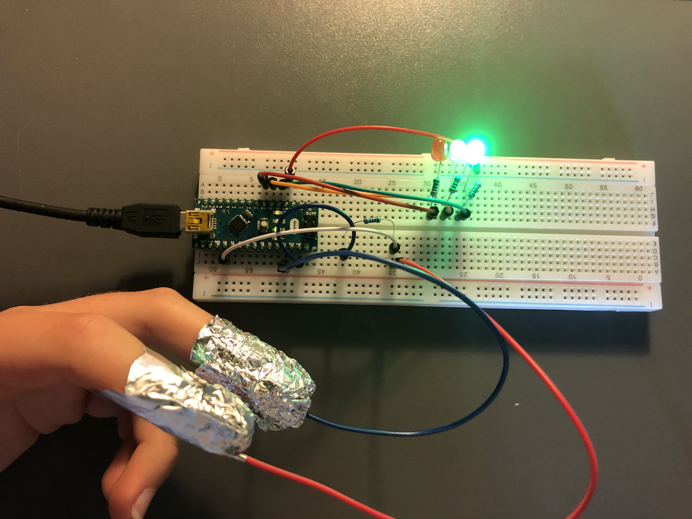
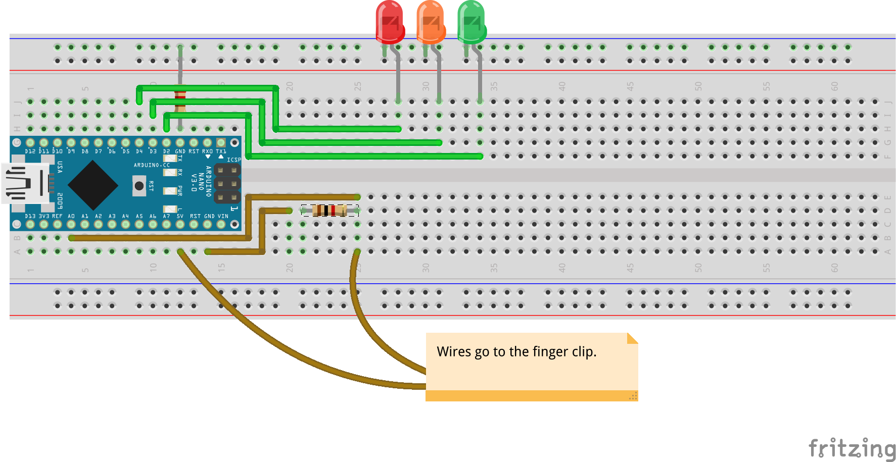
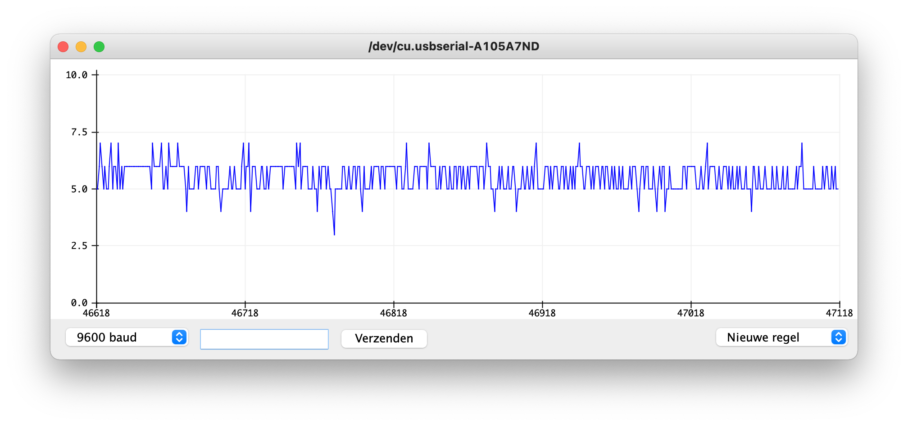
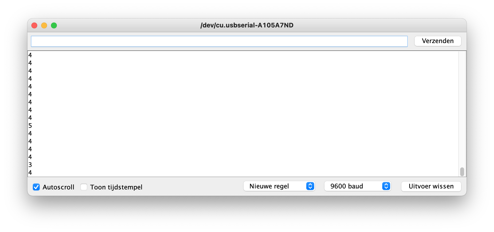

# Arduino Lie Detector

Who's been eating my cookies?

## Requirements

- Arduino
- Water Sensor
- 4 jumper wires (male to male)

And optionally, if you want LEDs to tell the output:

- 4 jumper wires (male to male)
- Red, yellow/orange and green LED
- 3x 220 ohm resistor

## How to use

### Wiring

Wire up above components as follows:

### Installation

Upload the [.ino file](arduino_lie_detector.ino) to your Arduino using the [Arduino IDE](https://www.arduino.cc/en/software).

| Name | Description | Type | Default |
|--|--|--|--|
| `ANALOG_PIN` | Analog pin you use. | Analog pin number | `A0` |
| `LED_RED` | Pin of the LED which blinks if someone's definitely lying. | Pin number | `4` |
| `LED_YELLOW` | Pin of the LED which blinks if the program's not sure whether someone's lying. | Pin number | `3` |
| `LED_GREEN` | Pin of the LED which blinks if someone's not lying. | Pin number | `2` |

### And now?

#### LEDs

There are three LEDs on the board:

- The **green LED** is on when someone's not lying.
- The **yellow/orange LED** is on when the program's not sure whether someone's lying.
- The **red LED** is on when someone's definitely lying.

#### Plotter or monitor

If you use one of the serial displays, the following pictures are the output of someone who's not lying.

| Serial plotter | Serial monitor |
|--|--|
|  | 

With the following table you can check if someone is lying:

| Value | Lying? |
|--|--|
| >30 | Yes |
| 15-30 | Maybe |
| <15 | No |
